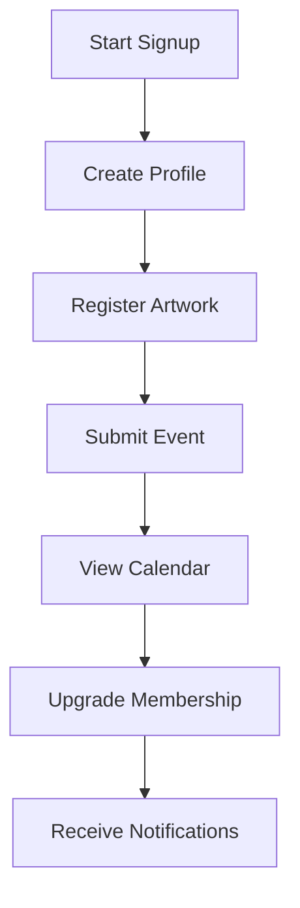

# ArtPulse Admin Guide

This guide covers the essential administration tasks for the ArtPulse plugin.

## What's New (v1.3+)
- Artworks For Sale toggle: admins can enable/disable sale features site-wide.
- Improved dashboards for artists, organizations, and members.
- Location-aware calendar with proximity highlights and legend.
- Price history and trends for artworks for sale.
- Refined admin and member notifications.
- Drag-and-drop dashboard widgets with an optional dark mode toggle.

For an overview of how a user interacts with ArtPulse, see the User Journey diagram below:

## Installation & Setup
1. Upload `artpulse.zip` via **Plugins → Add New** and activate.
2. Under **ArtPulse → Settings → General** configure timezone, date format and enable Auto‑expire Past Events.
3. Enter your Stripe keys and membership pricing in **Settings → Payments**. These keys are required for the Billing History table to load charge details.
4. Enable the `early_fraud_warning.created` webhook in Stripe and point it to `/wp-json/artpulse/v1/stripe-webhook`. This allows early fraud warnings to be logged and emailed to administrators.

## CSV Import / Export
- Navigate to **ArtPulse → Settings → Import / Export**.
- Upload a CSV and map columns to import Organizations, Events, Artists or Artworks via `POST /wp-json/artpulse/v1/import`.
- Export CSVs for offline editing or backup.

## Membership Overrides
Found in **Settings → General**. Toggles allow you to bypass Artist, Organization or Member membership checks when needed.

## Managing Members
Artists and members are WordPress users while organizations are a custom post type. Use **Users → All Users** or the post type screens to change roles, send reminders or deactivate accounts.

## Auto‑Expire Past Events
Enable this option in **Settings → General** to hide events automatically after their end date.

### Enabling/Disabling Artworks For Sale

- Go to **ArtPulse → Settings → General**.
- Find the “Enable Artworks for Sale” checkbox.
- When ON: artists/organizations see “For Sale?” toggle, price, and contact/buy fields in their dashboards and artwork forms.
- When OFF: all sale-related fields are hidden from dashboards and the public site, but stored data is preserved.
- See the [Admin Guide](../../docs/admin-guide.md) for setup details.

## Gutenberg Relationship Blocks
Blocks for **Artist ↔ Event** and **Artwork ↔ Organization** help you link related content in the editor.

## Payment Analytics Dashboard
Navigate to **ArtPulse → Payments** to see revenue and subscription trends over time.

## Engagement Dashboard
Open **ArtPulse → Engagement** to track member activity. The dashboard offers CSV export options and visual charts.

### Dashboard Upgrades
- Dashboards for artists, orgs, and members now show personalized stats, quick links, and recent activity.
- Use the admin panel to preview dashboards for each role.
- All major actions (add/edit artworks, manage events, upgrade membership) are one click away.
- Dashboard options are explained in the [Admin Guide](../../docs/admin-guide.md).

## Member Badges
Edit any user profile to assign badges. Enter badge slugs separated by commas in the **User Badges** field. Badges display on member dashboards and in directories.

## Login Heatmap
The **Login Heatmap** page under **ArtPulse → Settings** visualizes logins by day and hour for the past week. Darker cells indicate heavier activity and can help identify popular usage times.

## Event Galleries
When submitting or editing an event, the form now includes fields for a banner image and up to five gallery images. `[ap_submit_event]` and `[ap_edit_event id="123"]` automatically handle these uploads. The first image becomes the banner and the rest are stored as the event gallery.

In the **Events** list a new **Gallery** column displays thumbnails of uploaded images. Administrators can drag and drop these thumbnails to reorder them—changes save immediately via AJAX. The order determines how images appear on the single event page.

### Visual Calendar & Event Proximity
- The event calendar now displays events with location-based color highlights.
- A legend shows distance categories: <10km (green), <25km (yellow), <50km (blue).
- Admins can set or edit event locations (lat/lng, address, region) on the event form.
- The [Admin Guide](../../docs/admin-guide.md) covers calendar configuration.

## Admin Module Walkthrough
The administration screens follow the WordPress style guide, utilizing system fonts and the default blue (#2271b1) button color. See the [Admin Guide](../../docs/admin-guide.md) for a full tour of the primary modules.

## Styling Guidelines
- Use headings that match core WP admin (H2 for primary sections).
- Buttons should use the `button-primary` class.
- Keep iconography consistent with the Dashicons set.

## Shortcodes & Forms
The plugin registers the following shortcodes:
Attributes shown in the examples below are optional parameters and may be omitted.

| Shortcode | Purpose |
|-----------|---------|
| `[ap_artists]` | List artists. |
| `[ap_artworks]` | List artworks. |
| `[ap_directory]` | Directory of events, artists, artworks or organizations (deprecated, use the type-specific shortcodes). |
| `[ap_event_directory]` | Directory listing events. |
| `[ap_artist_directory]` | Directory listing artists. |
| `[ap_artwork_directory]` | Directory listing artworks. |
| `[ap_org_directory]` | Directory listing organizations. |
| `[ap_edit_event id="123"]` | Form to edit an event. |
| `[ap_events]` | List events. |
| `[ap_event_listing]` | List events with filter options. |
| `[ap_filtered_list]` | Display posts filtered by taxonomy. |
| `[ap_login]` | Front-end login and registration form. |
| `[ap_register]` | Standalone user registration form granting the Free membership level. |
| `[ap_logout]` | Log the current user out and redirect them. |
| `[ap_membership_account]` | Show the logged‑in user’s membership account. |
| `[ap_membership_purchase level="Pro"]` | Link to purchase a membership. |
| `[ap_my_events]` | List events submitted by the current user. |
| `[ap_my_follows]` | Display items the user follows. |
| `[ap_notifications]` | Show user notifications. |
| `[ap_artist_dashboard]` | Dashboard where artists can manage their artworks. |
| `[ap_org_dashboard]` | Dashboard for an organization with event management. |
| `[ap_org_profile_edit]` | Form to edit an organization profile. |
| `[ap_organizations]` | List organizations. |
| `[ap_portfolio_builder]` | Manage a member portfolio. Included within the organization dashboard for easy editing. |
| `[ap_profile_edit]` | Form for members to edit their profile. |
| `[ap_submission_form]` | Generic submission form (`post_type` attribute selects type). |
| `[ap_submit_event]` | Form to submit a new event. |
| `[ap_submit_organization]` | Form to submit a new organization. |
| `[ap_submit_artist]` | Form to submit a new artist profile. |
| `[ap_user_dashboard]` | Member dashboard with calendar and favorites. Accepts `show_forms` to embed submission forms. |
| `[ap_user_profile id="1" show_social="true" show_membership="true" show_completeness="true"]` | Display a user profile with optional sections. |
| `[ap_event_calendar]` | Event calendar view. |
| `[ap_event_map]` | Map of events. |
| `[ap_events_slider]` | Carousel of upcoming events. |
| `[ap_event_comments id="123"]` | Event comment list/form. |
| `[ap_event_filter]` | AJAX search/filter form, includes a security nonce. |
| `[ap_org_event_form]` | Organization event submission form. |
| `[ap_org_profile]` | Public organization profile. |
| `[ap_event_comments]` | Event comment list/form for the current event. |
| `[ap_membership_purchase]` | Link to purchase the default membership. |
| `[ap_user_profile]` | Display the current user's profile. |

`[ap_edit_event]` requires an `id` attribute identifying the event post. `[ap_events]` accepts `limit` to control how many events are listed.
Except where noted, the attributes used above are optional parameters.

Copy any of these into a page or post to expose ArtPulse functionality.

The **Settings → Shortcode Pages** screen lets you automatically generate pages containing any of the above shortcodes. Use the checkboxes to pick which pages to create.

When an organization submission is approved in the admin area, the organization
post is linked to the submitting user's account. This lets the user manage the
organization from the front‑end dashboard.

## Event RSVP Tools
Open an event's **Attendees** list to see everyone who RSVPed. Here you can mark attendance, remove users or export the list to CSV. Use the **Message All** button to email every RSVP, or click **Message** next to an attendee to send an individual note.

## Custom Admin Columns & Sorting
Post lists display extra columns like dates and membership level. Columns can be sorted or hidden using **Screen Options**.

## FAQs and Troubleshooting
- **Why can’t I see “for sale” options?** This feature may be disabled by the site admin. Ask your administrator if you need it enabled.
- **My event isn’t showing up on the calendar/map?** Double-check the event location and date in your dashboard.
- **System Status** lists recent webhook deliveries and server requirements.
- Import errors skip failed rows—verify column mappings if data is missing.
- For additional help see the Developer Guide or visit <https://docs.artpulse.io>.

## Organization Dashboard Caching
Organization dashboard queries are cached for 15 minutes using WordPress transient storage. This improves load time when viewing dashboard pages. Caches clear automatically whenever related organizations or events are modified.

