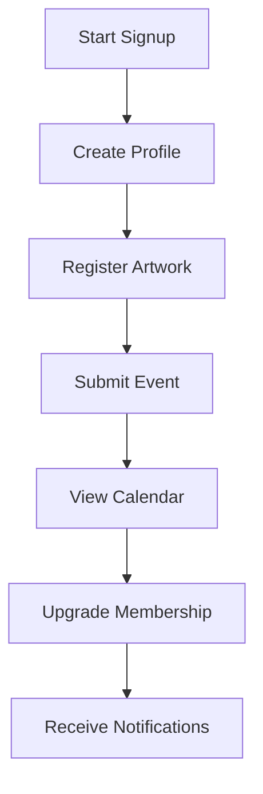

Admin Quick Start Guide

This guide covers the essential administration tasks for the ArtPulse plugin.

For an overview of how a user interacts with ArtPulse, see the User Journey diagram below:

## Installation & Setup
1. Upload `artpulse.zip` via **Plugins → Add New** and activate.
2. Under **ArtPulse → Settings → General** configure timezone, date format and enable Auto‑expire Past Events.
3. Enter your Stripe keys and membership pricing in **Settings → Payments**.

## CSV Import / Export
- Navigate to **ArtPulse → Settings → Import / Export**.
- Upload a CSV and map columns to import Organizations, Events, Artists or Artworks via `POST /wp-json/artpulse/v1/import`.
- Export CSVs for offline editing or backup.

## Membership Overrides
Found in **Settings → General**. Toggles allow you to bypass Artist, Organization or Member membership checks when needed.

## Managing Members
Artists and members are WordPress users while organizations are a custom post type. Use **Users → All Users** or the post type screens to change roles, send reminders or deactivate accounts.

## Auto‑Expire Past Events
Enable this option in **Settings → General** to hide events automatically after their end date.

## Gutenberg Relationship Blocks
Blocks for **Artist ↔ Event** and **Artwork ↔ Organization** help you link related content in the editor.

## Admin Module Walkthrough
The administration screens follow the WordPress style guide, utilizing system fonts and the default blue (#2271b1) button color. A screenshot (`images/admin_modules_walkthrough.png`) labels the primary modules.

## Styling Guidelines
- Use headings that match core WP admin (H2 for primary sections).
- Buttons should use the `button-primary` class.
- Keep iconography consistent with the Dashicons set.

## Shortcodes & Forms
The plugin registers the following shortcodes:

| Shortcode | Purpose |
|-----------|---------|
| `[ap_artists]` | List artists. |
| `[ap_artworks]` | List artworks. |
| `[ap_directory]` | Directory of events, artists, artworks or organizations (deprecated, use the type-specific shortcodes). |
| `[ap_event_directory]` | Directory listing events. |
| `[ap_artist_directory]` | Directory listing artists. |
| `[ap_artwork_directory]` | Directory listing artworks. |
| `[ap_org_directory]` | Directory listing organizations. |
| `[ap_edit_event id="123"]` | Form to edit an event. |
| `[ap_events]` | List events. |
| `[ap_filtered_list]` | Display posts filtered by taxonomy. |
| `[ap_login]` | Front-end login and registration form. |
| `[ap_membership_account]` | Show the logged‑in user’s membership account. |
| `[ap_membership_purchase level="Pro"]` | Link to purchase a membership. |
| `[ap_my_events]` | List events submitted by the current user. |
| `[ap_my_follows]` | Display items the user follows. |
| `[ap_notifications]` | Show user notifications. |
| `[ap_org_dashboard]` | Dashboard for an organization with event management. |
| `[ap_org_profile_edit]` | Form to edit an organization profile. |
| `[ap_organizations]` | List organizations. |
| `[ap_portfolio_builder]` | Manage a member portfolio. |
| `[ap_profile_edit]` | Form for members to edit their profile. |
| `[ap_submission_form]` | Generic submission form (`post_type` attribute selects type). |
| `[ap_submit_event]` | Form to submit a new event. |
| `[ap_submit_organization]` | Form to submit a new organization. |
| `[ap_user_dashboard]` | Member dashboard with calendar and favorites. |
| `[ap_user_profile id="1" show_social="true" show_membership="true" show_completeness="true"]` | Display a user profile with optional sections. |

Copy any of these into a page or post to expose ArtPulse functionality.

## Custom Admin Columns & Sorting
Post lists display extra columns like dates and membership level. Columns can be sorted or hidden using **Screen Options**.

## Troubleshooting
- **System Status** lists recent webhook deliveries and server requirements.
- Import errors skip failed rows—verify column mappings if data is missing.
- For additional help see the Developer Guide or visit <https://docs.artpulse.io>.

