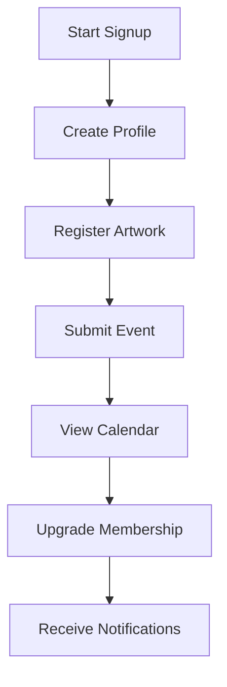

# ArtPulse Member Guide

Thank you for joining the ArtPulse community. This guide highlights the basics of creating and sharing your work.

### User Journey

## Creating and Editing Profiles
- Use the profile builder shortcode to update your artist details.
- Upload artworks, events or organization information through the submission forms.

## Following and Notifications
- Click the heart icon to favorite artworks or follow other members.
- Manage notifications from your user dashboard to stay informed of new activity.

## Submitting Events and Artworks
- The submission form lets you add descriptions, upload images and schedule dates.
- Depending on your membership level, submissions may require admin approval before publishing.

## Membership Levels and Billing
- Basic, Pro and Org plans provide different capabilities for uploading and promotion.
- View or update your subscription from the membership account page.

### Progress Tracker
| Tier | Profile Completion | Artwork Slots | Event Slots |
|------|-------------------|---------------|-------------|
| Basic | 50% of features | 3 | 1 |
| Pro   | All core features | 10 | 3 |
| Org   | Extended features | Unlimited | Unlimited |

## Event Calendar
The **My Calendar** view in your dashboard displays upcoming events you have registered for. Use the monthly navigation to see what's coming. A screenshot (`images/event_calendar_view.png`) illustrates this view.

## Artwork Registration
After creating your profile, register each piece through the **Add Artwork** form. Include high quality images and a detailed description. See `images/artwork_registration_form.png` for an example.

## Event Registration
When ready to promote an event, open **Submit Event** from your dashboard. Provide dates, times and location information. Example screenshot: `images/event_registration_form.png`.

### Upgrade Callout and Email Notifications
Members approaching upload limits will see an upgrade callout on their dashboard. Important account updates and submission status are also sent via email so be sure your address is current.
## Using the Directory
- Browse or search for artists, events and organizations using the directory filters.
- Filters help you narrow results by category, location or keyword.

