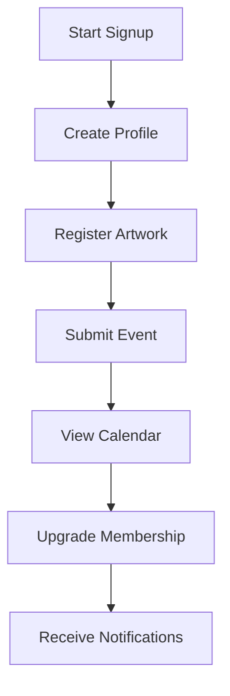

# ArtPulse Member Guide

Thank you for joining the ArtPulse community. This guide highlights the basics of creating and sharing your work.

## What's New (v1.3+)
- Artworks For Sale toggle controlled by admins.
- Improved dashboards for artists, organizations, and members.
- Location-aware calendar with proximity highlights and legend.
- Price history and trends for artworks for sale.
- Refined admin and member notifications.

### User Journey

## Creating and Editing Profiles
- Use the profile builder shortcode to update your artist details.
- Upload artworks, events or organization information through the submission forms.

## Following and Notifications
- Click the heart icon to favorite artworks or follow other members.
- When you favorite an event, a "favorite added" notification confirms it was saved.
- Manage notifications from your user dashboard to stay informed of new activity.

## Submitting Events and Artworks
- The submission form lets you add descriptions, upload up to five images and schedule dates.
- Depending on your membership level, submissions may require admin approval before publishing.

## Membership Levels and Billing
- Basic, Pro and Org plans provide different capabilities for uploading and promotion.
- View or update your subscription from the membership account page.

### Progress Tracker
| Tier | Profile Completion | Artwork Slots | Event Slots |
|------|-------------------|---------------|-------------|
| Basic | 50% of features | 3 | 1 |
| Pro   | All core features | 10 | 3 |
| Org   | Extended features | Unlimited | Unlimited |

### Using Your Dashboard
- Track your artworks, events, and membership status at a glance.
- Edit your profile and see recent notifications.
- Earn badges for engagement. Any badges granted by admins appear below your membership details.
- 

## Event Calendar
The **My Calendar** view in your dashboard displays upcoming events you have registered for. Use the monthly navigation to see what's coming. A screenshot (`images/event_calendar_view.png`) illustrates this view.

### Exploring Events Near You
- Allow browser location or set your home area to see events highlighted by proximity.
- Use the color legend to spot the closest events.
- Click an event to see full details, including distance from you and directions.
- 

## Artwork Registration
After creating your profile, register each piece through the **Add Artwork** form. Include high quality images and a detailed description. See `images/artwork_registration_form.png` for an example.

### Selling Artworks
- If enabled by the site admin, you’ll see a “For Sale?” option when adding/editing artworks.
- Enter a price and optional buy/contact link.
- Buyers can contact you or purchase directly from your artwork’s page.
- If this option isn’t visible, selling is currently disabled by the site admin.
- 

### Artwork Price History
- When viewing your artwork, you’ll see a list or chart of previous sale prices if you’ve changed the price over time.
- 

## Event Registration
When ready to promote an event, open **Submit Event** from your dashboard. Provide dates, times and location information. Example screenshot: `images/event_registration_form.png`.

### Event Images
Each event can include a banner plus up to five additional images. The submission and edit forms provide an **Images** field for this purpose. The first image is used as the banner while the rest display as a gallery below the event description on the site.

To update an existing event from the frontend, place the `[ap_edit_event id="123"]` shortcode on a page and replace `123` with the event ID.

### Upgrade Callout and Email Notifications
Members approaching upload limits will see an upgrade callout on their dashboard. Important account updates and submission status are also sent via email so be sure your address is current.

## RSVPs and Favorites
Click **RSVP** on an event page to reserve your spot. Your RSVPs and favorites appear in your dashboard calendars. Organizers may contact you, so keep your email address up to date.
## Using the Directory
- Browse or search for artists, events and organizations using the directory filters.
- Filters help you narrow results by category, location or keyword.
- The `[ap_event_listing]` shortcode also includes a form to filter events by venue, date range and category.

## FAQs and Troubleshooting
- **Why can’t I see “for sale” options?** This feature may be disabled by the site admin. Ask your administrator if you need it enabled.
- **My event isn’t showing up on the calendar/map?** Double-check the event location and date in your dashboard.

