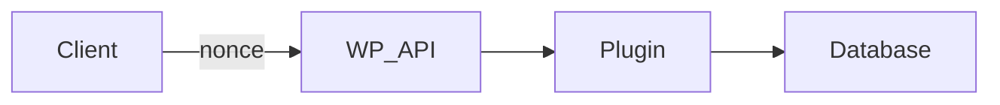

# ArtPulse API Basics & Authentication

This guide documents the REST API endpoints available for third-party integration.

## Authentication

Use WordPress nonce authentication for logged-in users or application passwords for external services.

Include the `X-WP-Nonce` header when calling endpoints from JavaScript.

## Endpoints

### `GET /artpulse/v1/status`

Returns the installed plugin version and database schema version. Useful for
health checks and debugging deployment issues.

Example request:

```bash
curl '/wp-json/artpulse/v1/status'
```

Response:

```json
{
  "plugin_version": "1.3.15",
  "db_version": "1.4.0",
  "cache": "Enabled",
  "debug": false
}
```

### `GET /artpulse/v1/filtered-posts`

Retrieve a list of posts filtered by taxonomy terms.
Parameters:
- `post_type` (string, required)
- `taxonomy` (string, required)
- `terms` (comma separated slugs)
- `per_page` (int, default `5`)
- `page` (int, default `1`)

Example request:

```bash
curl '/wp-json/artpulse/v1/filtered-posts?post_type=artpulse_artist&taxonomy=artist_specialty'
```

The response includes an array of post IDs, titles and permalinks along with pagination information.

### `GET /artpulse/v1/filter`

Retrieve directory items (events, artists, artworks or orgs) with optional filters.

Parameters mirror the shortcode filters:
`type`, `limit`, `event_type`, `medium`, `style`, `org_type`, `location`,
`city`, `region`, `for_sale`, `keyword`, `tags`, `price_type`, `lat`, `lng` and `radius`.

Results are cached for five minutes using a transient keyed by the request
parameters. The cache is flushed whenever related posts are updated.

### `GET /artpulse/v1/event/{id}/comments`

Retrieve approved comments for an event.
Parameters:
- `id` (int, required) – event post ID

Example request:

```bash
curl '/wp-json/artpulse/v1/event/42/comments'
```

### `POST /artpulse/v1/event/{id}/comments`

Add a new comment to the event. Requires authentication.
Parameters:
- `id` (int, required)
- `content` (string, required)

Example request:

```bash
curl -X POST -H 'X-WP-Nonce: <nonce>' -d 'content=Great+show!' \
  '/wp-json/artpulse/v1/event/42/comments'
```

### `POST /artpulse/v1/event/comment/{comment_id}/moderate`

Change comment status to `approve`, `spam` or `trash`.
Parameters:
- `comment_id` (int, required)
- `status` (`approve`|`spam`|`trash`)

Example request:

```bash
curl -X POST -H 'X-WP-Nonce: <nonce>' \
  -d 'status=approve' '/wp-json/artpulse/v1/event/comment/7/moderate'
```

See [Event Comments Codex](event-comments-codex.md) for details.

### `POST /artpulse/v1/favorite`

Add or remove a favorite.
Parameters:
- `object_id` (int, required)
- `object_type` (string, required)
- `action` (`add`|`remove`, required)

Example request:

```bash
curl -X POST -H 'X-WP-Nonce: <nonce>' \
  -d 'object_id=10&object_type=artpulse_event&action=add' \
  '/wp-json/artpulse/v1/favorite'
```
