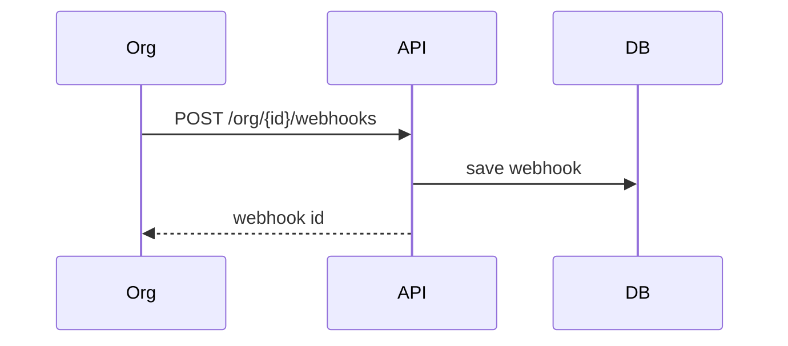

# ArtPulse API: Organizations & Extras


See the [Webhook Automations Codex](webhook-automation-codex.md) for event payloads and retry logic.


### `GET /artpulse/v1/recommendations`

Provide recommended events, artists or organizations for a user.

Parameters:
- `type` (string, required) – item category to recommend
- `user_id` (int, required)
- `limit` (int, default `5`)

Example request:

```bash
curl '/wp-json/artpulse/v1/recommendations?type=events&user_id=7&limit=3'
```

Example response:

```json
[
  {
    "id": 15,
    "title": "Emerging Artists Exhibit",
    "permalink": "https://example.com/events/emerging-artists-exhibit"
  },
  {
    "id": 27,
    "title": "Pop Art Retrospective",
    "permalink": "https://example.com/events/pop-art-retrospective"
  }
]
```

### `GET /artpulse/v1/inbox`

Return unified inbox items for the current user. Results include notifications,
direct messages and RSVP activity sorted by date.

Example request:

```bash
curl -H 'X-WP-Nonce: <nonce>' '/wp-json/artpulse/v1/inbox'
```

Each item contains:

- `id` – record identifier
- `type` – `message`, `notification` or `rsvp`
- `content` – text summary
- `timestamp` – MySQL datetime string
- `read` – boolean read state

Use `POST /artpulse/v1/inbox/read` with parameters `type` and `id` (or `ids[]`)
to mark items read. `POST /artpulse/v1/inbox/unread` reverts the state.

### `GET /artpulse/v1/bio-summary/{id}`

Return a short GPT-generated summary of an artist biography.

Example request:

```bash
curl '/wp-json/artpulse/v1/bio-summary/42'
```

Example response:

```json
{ "summary": "Award-winning painter based in NYC." }
```

### `GET /artpulse/v1/promoted`

Retrieve active artwork promotions ordered by priority.

Example request:

```bash
curl '/wp-json/artpulse/v1/promoted'
```

### `POST /artpulse/v1/promote`

Create a promotion for an artwork. Requires authentication with the
`edit_posts` capability.

Parameters:

- `artwork_id` (int, required)
- `start_date` (YYYY-MM-DD, required)
- `end_date` (YYYY-MM-DD, required)
- `type` (`featured` default)
- `priority_level` (int)

### `POST /artpulse/v1/profile/{id}/verify`

Mark a profile as verified. Administrator access required.

Parameters:

- `id` (int, required)

Example request:

```bash
curl -X POST -H 'X-WP-Nonce: <nonce>' \
  '/wp-json/artpulse/v1/profile/42/verify'
```

## User Meta Fields

Several endpoints store preferences using user meta. Keys of interest:

- `ap_notification_prefs` – associative array with boolean `email`, `push` and `sms` values saved via `POST /artpulse/v1/user-preferences`.