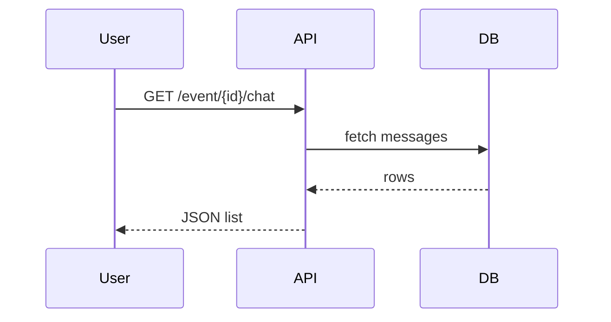

# Chat Widget

```mermaid
sequenceDiagram
  User->>API: GET /event/{id}/chat
  API->>DB: fetch messages
  DB-->>API: rows
  API-->>User: JSON list
```

The chat widget displays live messages and allows attendees to post updates during an event.

💬 Found something outdated? Submit Feedback
