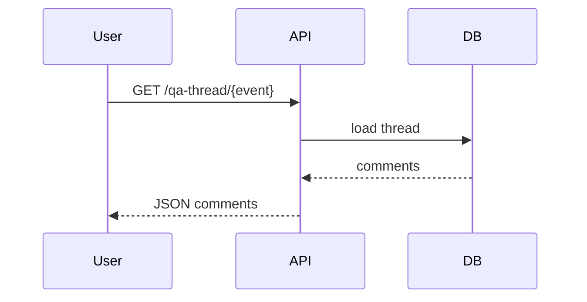

# Q&A Widget

```mermaid
sequenceDiagram
  User->>API: GET /qa-thread/{event}
  API->>DB: load thread
  DB-->>API: comments
  API-->>User: JSON comments
```

Attendees can submit questions which display in a threaded list.
