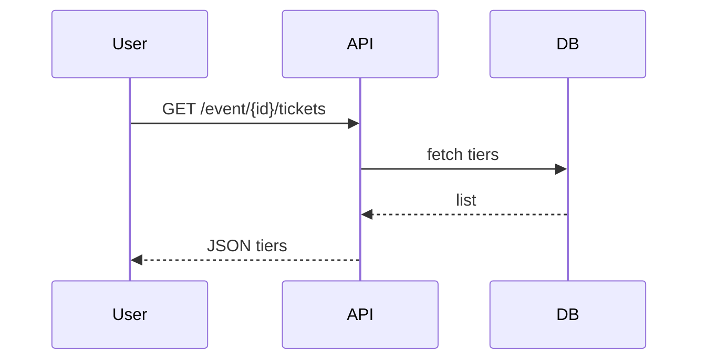

# Ticketing Widget

```mermaid
sequenceDiagram
  User->>API: GET /event/{id}/tickets
  API->>DB: fetch tiers
  DB-->>API: list
  API-->>User: JSON tiers
```

This widget lists available ticket tiers and posts purchases to `/buy-ticket`.

> 💬 *Found something outdated? [Submit Feedback](../feedback.md)*
