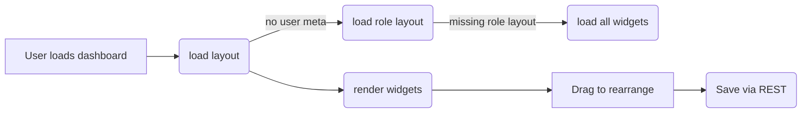

# User Dashboard Customization

This document explains how ArtPulse stores each user's dashboard layout, which REST and AJAX actions are involved, and the expected widget schema. It supplements the [User Dashboard Layout Codex](../../widgets/widget-layout-import-export-guide.md).

Dashboards for members, artists and organizations are all rendered through the `[ap_user_dashboard]` shortcode. Each role has a default widget order but individual users can rearrange and hide widgets to suit their needs. The saved layout is restored whenever they return to their dashboard. The **Add Widget** panel in the admin editor now lists role tags so administrators can quickly see which roles can access a widget and filter the list accordingly.
Users can enable additional widgets by clicking **Add Widget** and selecting from the palette. If a widget is missing entirely, ask an administrator to check the role settings.

## Layout Storage

- **Per user:** Layouts are stored in the `ap_dashboard_layout` user meta key. Visibility settings live in `ap_widget_visibility`.
 - **Per role:** Default layouts are saved in the `ap_dashboard_widget_config` option as arrays of widget IDs keyed by role.
- Legacy exports may contain arrays describing each widget. Example:

```json
[
  { "id": "welcome_widget", "visible": true },
  { "id": "stats_widget", "visible": false }
]
```

When a user has no saved layout, `UserLayoutManager::get_layout_for_user()` falls back to their role configuration and finally to all registered widgets.

## Endpoints

Dashboard preferences are exposed via the following endpoints:

```text
GET  /wp-json/artpulse/v1/ap_dashboard_layout
POST /wp-json/artpulse/v1/ap_dashboard_layout
```

Both endpoints require the requester to be logged in. The POST request accepts a JSON body:

```json
{
  "layout": [ { "id": "widget-id" } ],
  "visibility": { "widget-id": true }
}
```

A successful POST returns `{ "saved": true }`.

AJAX actions used in the admin editor include:

```text
ap_save_dashboard_widget_config
ap_reset_dashboard_layout
```

These actions rely on nonces created with `wp_create_nonce()` and check `manage_options` capability before saving options.

## Widget Schema

Each widget definition registered via `DashboardWidgetRegistry::register()` uses the following structure:

```php
DashboardWidgetRegistry::register(
    'id',              // slug used in layouts
    'Title',           // human label
    'icon-name',       // dashicon or lucide name
    'Description',
    'callback',        // function to render markup
    [
        'roles'    => ['member', 'artist'], // visibility control
        'settings' => [                     // optional user settings
            [ 'key' => 'limit', 'type' => 'number', 'default' => 5 ]
        ]
    ]
);
```

Only widgets allowed for a role will appear in that role's editor. Settings are persisted per user in `ap_widget_settings_{id}`.

## Visual Example



The flow above shows how a dashboard is rendered and personalized. Users drag widgets within the dashboard; the positions and visibility are saved via the `/ap_dashboard_layout` endpoint and restored on the next visit.

---

For additional design guidelines and example code, see the [Widget Settings Codex](../../widgets/widget-settings-codex.md) and the [Dashboard Widget Design Codex](../../dashboard-widget-design-codex.md).

## User Dashboard Customization Codex

### Overview
This section outlines how to implement drag‑and‑drop dashboards with role specific layouts. User preferences should persist and the interface must be usable on mobile devices.

### 1. 🎛️ Enable Front-End Widget Arrangement
**Goals**

- Allow users to customize the dashboard layout using drag and drop.
- Provide a responsive experience across desktop and mobile devices.

**Implementation**

Use `react-grid-layout` or `Gridstack.js` to render draggable and resizable widgets. Mount the editor on the dashboard page template or the `[artpulse_user_dashboard]` shortcode.

```jsx
import GridLayout from "react-grid-layout";

<GridLayout
  className="layout"
  cols={12}
  rowHeight={30}
  width={1200}
  onLayoutChange={handleLayoutChange}
>
  <div key="widget1">Messages</div>
  <div key="widget2">Ticket Stats</div>
</GridLayout>
```

The plugin implementation instead uses the lightweight
[SortableJS](https://sortablejs.github.io/Sortable/) library. The
`assets/js/user-dashboard-layout.js` script initializes Sortable on the
`#ap-user-dashboard` container and posts layout changes to the
`ap_save_user_layout` AJAX action.

### 2. 💾 Store User Layout Preferences
**Goals**

- Persist widget positions per user.
- Fall back to role defaults if a user has no saved layout.

**WordPress Integration**

Save the layout JSON to a user meta key:

```php
update_user_meta( $user_id, '_artpulse_dashboard_layout', json_encode( $layout_data ) );
```

Retrieve the stored value:

```php
$layout = json_decode( get_user_meta( $user_id, '_artpulse_dashboard_layout', true ), true );
```

If nothing is saved, load an option with role defaults:

```php
get_option( '_artpulse_role_layout_artist' );
```

### 3. 🔐 Admin Widget Visibility Rules
**Goals**

- Give administrators control over which widgets appear for which roles.

Extend the widget registration array with a `visibility` list:

```php
$registered_widgets[] = [
  'id'        => 'artist_overview',
  'title'     => 'Artist Overview',
  'component' => 'ArtistOverviewPanel',
  'visibility' => [ 'admin', 'artist' ],
];
```

Filter widgets when rendering based on the current role:

```php
$current_role = wp_get_current_user()->roles[0];
$allowed      = array_filter( $widgets, fn( $w ) => in_array( $current_role, $w['visibility'], true ) );
```

### 4. 📱 Responsive & Mobile-Friendly Layout
Use a responsive grid system such as Tailwind or Bootstrap so widgets stack on narrow screens. Enable touch dragging with a library like `react-draggable`, and provide an "Edit Mode" toggle on mobile if required.

### 5. 📄 Codex Documentation Requirements
Documentation should describe:

- Widget JSON structure.
- User meta key names.
- REST or AJAX endpoints (e.g. `GET /user-layout`, `POST /user-layout`).
- Role fallback behaviour.
- Screenshots or mockups for desktop and mobile views.
- Error handling for invalid JSON and fallback logic.

> 💬 *Found something outdated? [Submit Feedback](../../feedback.md)*
