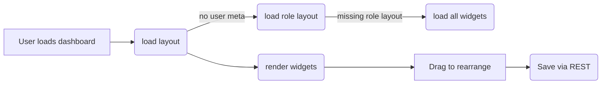

# User Dashboard Customization

This document explains how ArtPulse stores each user's dashboard layout, which REST and AJAX actions are involved, and the expected widget schema. It supplements the [User Dashboard Layout Codex](./user-dashboard-layout-codex.md).

## Layout Storage

- **Per user:** Layouts are stored in the `ap_dashboard_layout` user meta key. Visibility settings live in `ap_widget_visibility`.
- **Per role:** Default layouts are saved in the `ap_dashboard_widget_config` option.
- The layout array contains ordered entries describing each widget:

```json
[
  { "id": "welcome_widget", "visible": true },
  { "id": "stats_widget", "visible": false }
]
```

When a user has no saved layout, `UserLayoutManager::get_layout_for_user()` falls back to their role configuration and finally to all registered widgets.

## Endpoints

Dashboard preferences are exposed via the following endpoints:

```text
GET  /wp-json/artpulse/v1/ap_dashboard_layout
POST /wp-json/artpulse/v1/ap_dashboard_layout
```

Both endpoints require the requester to be logged in. The POST request accepts a JSON body:

```json
{
  "layout": [ { "id": "widget-id" } ],
  "visibility": { "widget-id": true }
}
```

A successful POST returns `{ "saved": true }`.

AJAX actions used in the admin editor include:

```text
ap_save_dashboard_widget_config
ap_reset_dashboard_layout
```

These actions rely on nonces created with `wp_create_nonce()` and check `manage_options` capability before saving options.

## Widget Schema

Each widget definition registered via `DashboardWidgetRegistry::register()` uses the following structure:

```php
DashboardWidgetRegistry::register(
    'id',              // slug used in layouts
    'Title',           // human label
    'icon-name',       // dashicon or lucide name
    'Description',
    'callback',        // function to render markup
    [
        'roles'    => ['member', 'artist'], // visibility control
        'settings' => [                     // optional user settings
            [ 'key' => 'limit', 'type' => 'number', 'default' => 5 ]
        ]
    ]
);
```

Only widgets allowed for a role will appear in that role's editor. Settings are persisted per user in `ap_widget_settings_{id}`.

## Visual Example



The flow above shows how a dashboard is rendered and personalized. Users drag widgets within the dashboard; the positions and visibility are saved via the `/ap_dashboard_layout` endpoint and restored on the next visit.

---

For additional design guidelines and example code, see the [Widget Settings Codex](./widget-settings-codex.md) and the [Dashboard Widget Design Codex](./dashboard-widget-design-codex.md).
